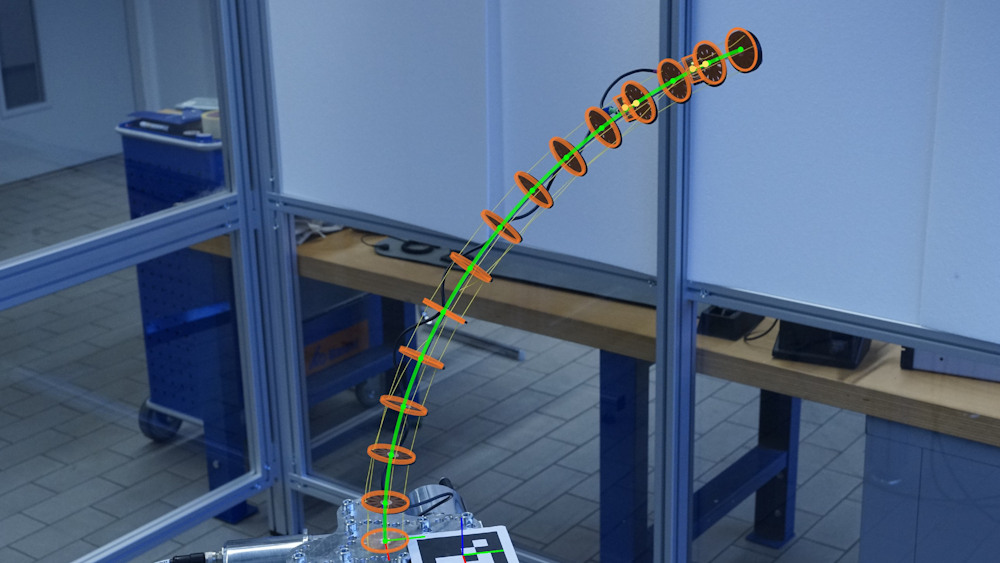
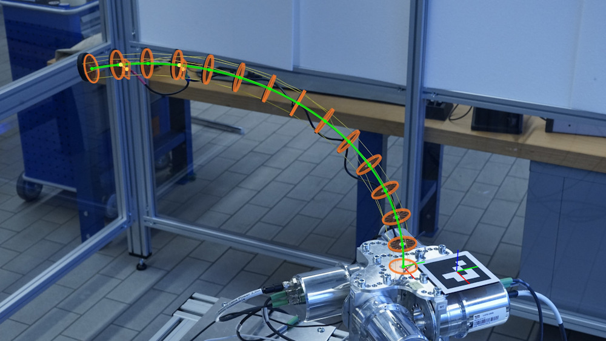
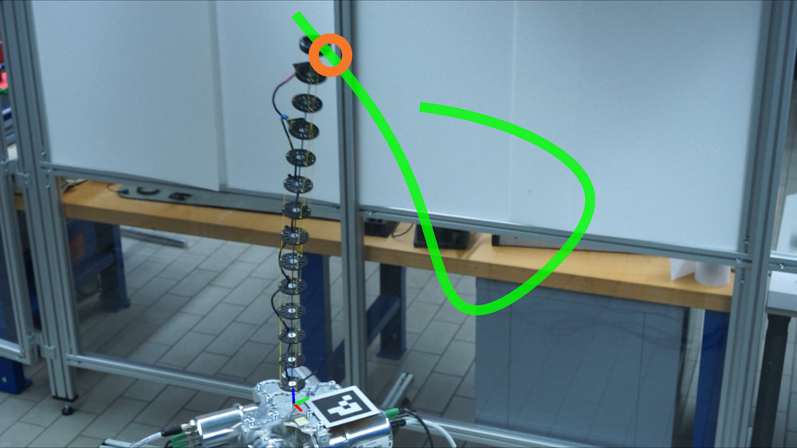
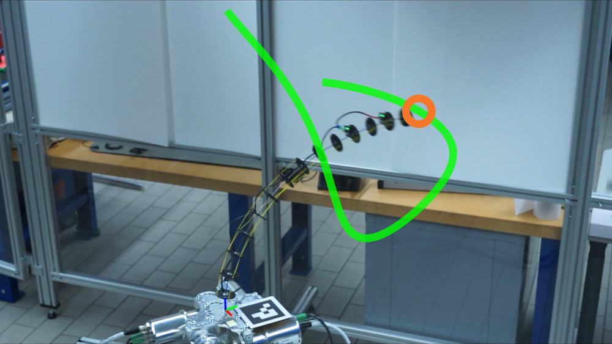

   

# PETER - Experimental Validation & Optimal Control

Experimental model validation & optimal control of the tendon-actuated continuum robot PETER.

This repository contains various scripts and functions for the experimental identification and validation of robot system models and for optimal feedforward control.
The code in this repository is used for the model validation and optimal control experiments in [1,2].

In particular, the repository offers:

- Optimization-based identification of static and dynamic robot system models
- Visual validation of static system models and dynamic trajectory tracking experiments
- Generation of optimal feedforward control trajectories
- Preprocessing and filtering of experimental data
- Static calibration of MEMS accelerometers based on static measurement data

Most of the scripts are specifically adapted to the tendon-driven continuum robot PETER [1,2], but can be generalized to other robotic systems in a straightforward way.

**Note:**
This repository only contains the MATLAB code for the experiments, not the experimental data.
To run most of the scripts, the corresponding input data is required.
The experimental data used in [1] will be provided for download in the future.

## Requirements

* MATLAB R2025b
   - Required toolboxes: Signal Processing Toolbox, Computer Vision Toolbox, Image Processing Toolbox, Optimization Toolbox (and the toolboxes required by ELARA)
* [ELARA](https://github.com/ELARA-Toolbox/ELARA) Toolbox, V0.1 (installed and available on the MATLAB path)
* [CasADi](https://web.casadi.org/) V3.7.2 (installed and available on the MATLAB path)

Later versions of the required software may work, but have not been tested and may lead to different results.
The code is tested on Windows 11.

## Experimental Workflows

### Prerequisites

1. Make sure the MEX files in ELARA have been built correctly (run `elara.build` and check with `elara.setup`).

1. Run `startup_experiments.m` to add all required functions to the MATLAB path and check for dependencies.

### Parameter Identification and Model Validation

The scripts for parameter identification and model validation are found in the subfolder `model-validation`.

1. Record data:
   Run script `peter_rt_model_run_identification.m` (from the PETER Speedgoat repository) on the PETER host PC.
   The script records both static and dynamic data.
   This repository/code is not available publicly.

1. If desired, take photos during the static setpoints for visual validation.
   Make sure that the ArUco markers are clearly visible and unobstructed.

1. Preprocess static data:

    - Extract setpoints from all individual recordings with `prepare_static_setpoint_data.m`

    - Combine multiple setpoint files into a single file with `combine_static_setpoint_data.m`
      (the static data are split across several files to limit the size of the original Speedgoat recording files).
       
1. Run the IMU accelerometer calibration to estimate the calibration parameters with `calibrate_accelerometers.m`.
   This saves the calibration parameters in the specified output folder.
   Skip this step if the calibration parameters are already available.

1. Run the model parameter identification. This repository offers the following options:
   
   - `identification_system_parameters_static.m`: Identification based on "static" data obtained from static configuration setpoints.
   
   - `identification_system_parameters_dynamic.m`: Identification based on data from a dynamic motion.
   
   - `identification_system_parameters_combined.m`: Combined identification, where data from both static and dynamic experiments are used to minimize the output error across all data types.
    
   Before running the scripts, adjust the folder/file names.
   For the validation in [1], only the static identification was used.

1. Validation based on measurement data:
   Run `model_validation_combined.m`, which compares the recorded static and dynamic data to simulations.

1. Visual validation based on photos:
   Create a new function `photoComparisonDefinition_XY.m`
   that defines the file paths and static tensions corresponding to the previously taken photos.
   Then run `model_validation_visual_static.m` to generate the photos with the overlay from simulations.
    
If the identification is only used to obtain IMU and tendon calibration parameters,
then the visual validation can be done independently of the identification.

### Trajectory tracking experiment

The scripts for trajectory tracking are found in the subfolder `trajectory-tracking`.

1. Prepare an identified/validated model of the robot.

2. Generate the optimal trajectory with the script `tracking_generate_trajectory.m`.

3. Run the trajectory on PETER using the script `peter_rt_model_run_tracking_experiment.m` from the PETER Speedgoat repository. This code is not part of this repository.

4. For visual validation, record the experiment on video with a fixed camera mounted on a tripod.
   Additionally, take a high-resolution photo from the same camera position; it is used to extract the camera pose.

5. Visual validation:
   Run the script `tracking_validation_video.m` to compare the video to the desired trajectory.

6. Validation of the data:
   Run the script `tracking_validation_data.m` to compare the recorded data to the data from the OCP / simulations. 

### Notes for Visual Validation

The following points apply when overlaying experimental photos or videos with the simulated robot configuration:

- The camera must be calibrated using a checkerboard and the MATLAB camera calibration toolbox.
  Save the intrinsic camera parameters generated by the toolbox as a `.mat` file
  that can be accessed by the photo/video validation scripts.

- The current setup with one marker can be easily extended to multiple markers at arbitrary locations.
  For this, calibration photos must be taken  that contain at least two markers;
  then, these photos can be used to extract their relative poses, which can be saved in a `.mat` file
  or function.

- New markers can be created in MATLAB or with the [ArUco marker generator](https://chev.me/arucogen/).

## Additional Information
For implementation details, see the [ELARA documentation](https://github.com/ELARA-Toolbox/ELARA), and for background on the systems and experiments, see [1,2].

## License

The code in this repository is licensed under the MIT License; see [LICENSE](LICENSE).

## References

[1] M. Herrmann. Geometric Modeling and Optimal Control of Rigid-Flexible Robot Manipulators. PhD Thesis, Technical University of Munich, 2026 (in preparation).

[2] M. Herrmann, L. Pfeiffer, and P. Kotyczka. "Discrete Geometric Modeling and Extended State Estimation of Continuum Robots." [arXiv:2606.21205](https://arxiv.org/abs/2606.21205) (2026).
